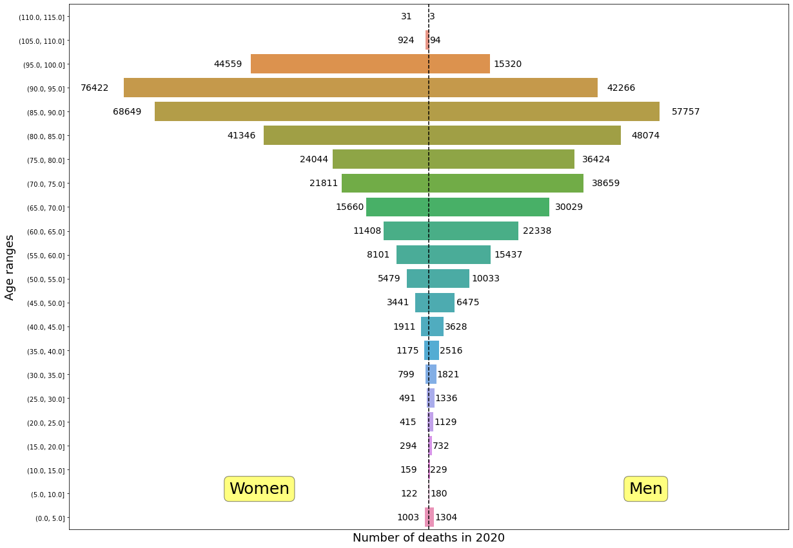

## Deaths in France in 2020

* The [National Institute of Statistics and Economic Studies](https://www.insee.fr/en/accueil) 
releases public available data on deaths in France every year. It is a popular datafile to work with and there are many projects using and tools available to explore the file at [data.gouv.fr](https://www.data.gouv.fr/fr/datasets/fichier-des-personnes-decedees/)

* I tried my hand at organizing the data and use a few vizualization techniques I will expose here.

The raw file lacks for most of the entries a country of birth and I filled it accordingly to the birth location matching how the coding for it evolved over time. 
The process can be replicated after collecting the required csv files available at 
[Insee files](https://www.insee.fr/fr/information/2560452) using [clean_INSEE_csv.py.py](https://github.com/GreLeBr/deces_2020/blob/master/deces_2020/clean_INSEE_csv.py)


### Age pyramid of deaths in France

* Deaths are categorized in group spanning a range of 5 years by using a bins variable and cutting the 
dataframe accordingly. Age of the person deceased is calculated by substrating day of death to day of birth, the results is left as years for easier classfication. The dataframe is further groupby using the sex variable.  




```python
# Building categories for age group
bins = pd.IntervalIndex.from_tuples([(0, 5), (5, 10), (10, 15), (15,20),(20,25),
 (25,30), (30,35), (35,40), (40,45), (45,50), (50, 55),(55, 60), (60,65),
  (65,70), (70,75), (75, 80), (80,85), (85, 90), (90, 95), (95,100),
   (105,110), (110,115) ])
# Starting by making temp columns
df["birthdate1"]=df["datenaiss"].astype("str")
df["deathdate1"]=df["datedeces"].astype("str")
# Assigning "NaN" to missing dates
df["birthdate1"]=df["birthdate1"].apply(lambda x: np.nan if "00" in
 x[-2:] or "00" in x[-4:-2] or "0000" in x[:-4] or x=="0" else x)
df["deathdate1"]=df["deathdate1"].apply(lambda x: np.nan if "00" in
 x[-2:] or "00" in x[-4:-2] or "0000" in x[:-4] or x=="0" else x)
# Dropping missing values
df.dropna(inplace=True)
# Dropping temp columns
df.drop(columns=["deathdate1", "birthdate1"], inplace=True)
# Converting date str to date values
df["birthdate"]=pd.to_datetime(df["datenaiss"],  format='%Y%m%d')
df["deathdate"]=pd.to_datetime(df["datedeces"],  format='%Y%m%d')
# Assigning age group to rows
df['Range']=df.groupby("sexe", as_index=False)[["lifespan"]]
.transform(lambda x: pd.cut(x, bins) )

# Grouping values by sex
data=df.groupby(["sexe", "Range"], as_index=False)[["lifespan"]].count().copy()

# Inverting data for woman to plot them alongside male data 
data["lifespan"][22:]=data["lifespan"][22:].apply(lambda x: -x)

# Drawing figure

plt.figure(figsize=(20,15))
plt.xlim((-90000, 90000))

# Creating a line separating left from right on 0
plt.axvline(x=0, linestyle='--', color="black")

# Plotting men data, the categories are reverted to display age range from bottom to top
bar_plot = sns.barplot(x='lifespan', y='Range', data=data[22:],  order=data["Range"][21::-1])

# To add a label on each row the text is placed accordingly to the value of the data with a bit of 
# an offset

for ytick in bar_plot.get_yticks():
    bar_plot.text(data["lifespan"][21-ytick] + 100+ data["lifespan"][21-ytick]* 0.05,
    ytick,  data["lifespan"][21-ytick], verticalalignment="center",  fontsize=14 )

# Plotting woman data with similar techniques 
bar_plot = sns.barplot(x='lifespan', y='Range', data=data[:22],  order=data["Range"][21::-1])
for ytick in bar_plot.get_yticks():
    bar_plot.text(data["lifespan"][43-ytick] -7000 + data["lifespan"][43-ytick]* 0.05, ytick,
    -data["lifespan"][43-ytick], verticalalignment="center", ha="left", fontsize=14)  

bar_plot.tick_params( axis='x',          # changes apply to the x-axis
    which='both',      # both major and minor ticks are affected
    bottom=False,      # ticks along the bottom edge are off
    top=False,         # ticks along the top edge are off
    labelbottom=False) # labels along the bottom edge are off

bar_plot.set_xlabel(xlabel="Number of deaths in 2020",fontsize=18 )
bar_plot.set_ylabel(ylabel="Age ranges",fontsize=18 )

# adding boxes for description
props = dict(boxstyle='round', facecolor='yellow', alpha=0.5)

bar_plot.text(50000, 20, "Men", fontsize=25,bbox=props )
bar_plot.text(-50000, 20, "Women", fontsize=25, bbox=props )

``` 

Following popular blog [Le prénom : catégorie sociale](http://coulmont.com/bac/index.html)
I plotted first_name by age of deaths as well as last_name by age of death.

Using first name:

[First_name](https://chart-studio.plotly.com/~GreLeBr/13)


and specficically for people born abroad: 

[First_name_abroad](https://chart-studio.plotly.com/~GreLeBr/3)

With the last name :

[Last_name](https://chart-studio.plotly.com/~GreLeBr/11)

and included the gender



Code is as follow :

```python
# Grouping data according to first name, gender and country of birth
data4=df.groupby(['sexe',"first_name", "paysnaiss"], as_index=False)[["sexe", "lifespan"]]
.agg({"sexe": "mean", "lifespan": ["mean", "std", "count"]})

# Joining the multi layered columns
data4.columns = ['_'.join(col) for col in data4.columns]

# Droping the index
data4.reset_index(inplace=True)

# Renaming columns
data4.rename(columns={"first_name_":"prenom", "paysnaiss_": "paysnaiss","sexe_mean":"sex", "lifespan_mean":"Average_Age", "lifespan_std":"Age_Std", "lifespan_count":"count"}, inplace=True)

# Taking a subset of the first 500 results according to count and average age
data5=data4.sort_values(["count","Average_Age"], ascending=False).head(500)

# Transforming the sex column as string to only have two distinct categories in plotly
data5["sex"]=data5["sex"].astype("str")

# Ploting plotly figure
fig=px.scatter(data5, x="Average_Age", y="count", log_y=True, color="sex",size="count", size_max=75,  hover_data={"prenom":True, "Average_Age":':.2f', "Age_Std":':.2f'})  
fig.show()

# for people born abroad
fig=px.scatter(data5[data5["paysnaiss"]!="FRANCE"], x="Average_Age", y="count", log_y=True, color="sex",size="count", hover_data={"prenom":True, "Average_Age":':.2f', "Age_Std":':.2f', "paysnaiss":True})  
fig.show()

# Similarly grouping by name
data3=df.groupby(['sexe',"nom",  "paysnaiss"] , as_index=False)[["sexe", "lifespan"]].agg ({"sexe": "mean", "lifespan": ["mean", "std", "count"]})
data3.columns = ['_'.join(col) for col in data3.columns]
data3.reset_index(inplace=True)
data3.drop(columns="index", inplace=True)
data3.rename(columns={"nom_":"nom", "paysnaiss_": "paysnaiss","sexe_mean":"sex", "lifespan_mean":"Average_Age", "lifespan_std":"Age_Std", "lifespan_count":"count"}, inplace=True)
data2=data3.sort_values(["count","Average_Age"], ascending=False).head(500)
data2["sex"]=data2["sex"].astype("str")
fig=px.scatter(data2, x="Average_Age", y="count", log_y=True, color="sex",size="count", hover_data=[data2["nom"]])
fig.show()

# Not including gender
no_sex=df.groupby(["nom",  "paysnaiss"] , as_index=False)[["lifespan"]].agg ( ["mean", "std", "count"])
no_sex.columns = ['_'.join(col) for col in no_sex.columns]
no_sex.reset_index(inplace=True)
no_sex.rename(columns={ "lifespan_mean":"Average_Age", "lifespan_std":"Age_Std", "lifespan_count":"count"}, inplace=True)
no_sex_500=no_sex.sort_values(["count","Average_Age"], ascending=False).head(500)
fig=px.scatter(no_sex_500, x="Average_Age", y="count", log_y=True, size="count", hover_data=[no_sex_500["nom"]])
fig.show()
```

It is possible to map the average age death to geographical division in France.
Here I associated it with the communes location, although the result is a bit too dense to be easily readable.



Code is as follow: 
```python
# Loading the geojson file I previously made using the June 2021 IGN data
with open('../raw_data/data.json', 'w') as f:
    json.dump(commu, f)

# Adding the geojson file that has the "arrondissements" for Paris, Lyon and Marseille, there is some overlap sadly
# I strip the file of its properties for easier manipulation
with open("../raw_data/arrondissement_simp.json") as json_file:
  arron = json.load(json_file)
for items in arron["features"]:
    items["properties"].pop("DATE_CREAT", None)
    items["properties"].pop("ID", None)
    items["properties"].pop("DATE_MAJ", None)
    items["properties"].pop("DATE_CONF", None)
    items["properties"].pop("DATE_APP", None)
    items["properties"].pop("ID_AUT_ADM", None)
    items["properties"].pop("ID_CH_LIEU", None)
    items["properties"]["INSEE_COM"]=items["properties"]["INSEE_ARM"]

# Merging the two geojson together to display all locations
commu["features"].extend(arron["features"])

# Previously I ran a function to update the communes name of birth to their current equivalent using
communes=pd.read_csv("../raw_data/commune2021.csv")
# Making a dictionary of the new value
dict_value={k:v for k,v in zip(movement["COM_AV"], movement["COM_AP"])}
# Applying the update
df["lieunaiss_str"]=df["lieunaiss_str"].apply(lambda x: dict_value[x] if x in dict_value.keys() else x)

# Grouping the original dataset by communes
df_communes_group=df[df["paysnaiss"]=="FRANCE"].groupby(["lieunaiss_str"] , as_index=False)[["lifespan"]].agg(["mean", "std", "count"]) 
df_communes_group.columns = ['_'.join(col) for col in df_communes_group.columns]
df_communes_group["lieunaiss_str_col"]=[df_communes_group.index[i] for i in range (df_communes_group.shape[0])]
df_communes_group.reset_index(inplace=True)

# Ploting the figure
fig=px.choropleth_mapbox(df_canton_group, geojson=commu, locations="lieunaiss_str_col", featureidkey="properties.INSEE_COM", color="lifespan_mean",
                           color_continuous_scale="Viridis",
                           range_color=(55, 100),
                           mapbox_style="carto-positron",
                           center=dict(lat=46.2276, lon=2.2137), zoom=3,
                           opacity=0.5                    
                          )
fig.update_layout(margin={"r":0,"t":0,"l":0,"b":0})
fig.show()

```


[Predict age by name](https://www.ekintzler.com/projects/age-prediction/)
<!-- 
<iframe src=https://grelebr.github.io/deces_2020/choropleth.html style="width: 500px;
height: 800px; border: 0px"></iframe> -->


[Choropleth on GitHub](https://grelebr.github.io/deces_2020/choropleth.html)

[Choropleth on Heroku](https://choropleth-greg.herokuapp.com/)

[Insee files](https://www.insee.fr/fr/information/2560452)


``` python
# Splitting First name and last name
df["nomprenomsplit"]=df["nomprenom"].apply(lambda x: x.split("*"))
df["nom"]=df["nomprenomsplit"].apply(lambda x: x[0])
df["prenom"]=df["nomprenomsplit"].apply(lambda x: x[1])
df["prenom"]=df["prenom"].apply(lambda x: x.replace("/", ""))
``` 
